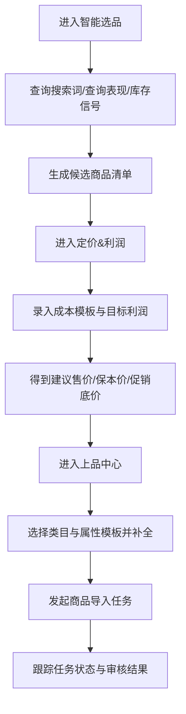
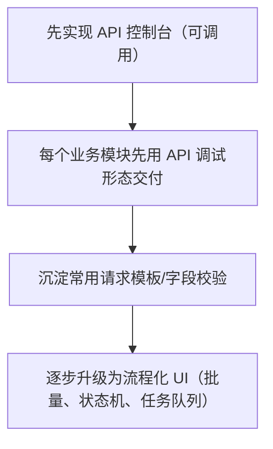

## 1. 产品概述
OZON-ERP 管理台是一个面向 OZON 跨境卖家的运营工作台：把“智能选品/上品/定价利润/订单售后/财务对账/客服”集中到一个统一的 Web 控制台。
- 目标用户：跨境卖家运营、上新专员、客服、财务、负责人
- 核心价值：减少多系统来回切换，把 OZON API 能力产品化为“可操作的工作流”

## 2. 核心功能

### 2.1 用户角色
| 角色 | 注册/登录方式 | 核心权限 |
|---|---|---|
| 管理员 | 本地账号（MVP 先内置单管理员） | 全部模块、API 配置、权限管理 |
| 运营 | 本地账号 | 选品/上品/商品/促销/定价 |
| 客服 | 本地账号 | 聊天/评价/问答/售后 |
| 财务 | 本地账号 | 财务流水/对账/利润报表 |

### 2.2 功能模块（页面级）
1. **总览仪表盘**：关键指标卡片、快捷入口、最近调用/任务状态
2. **API 控制台（OZON）**：按模块展示可用接口，一键请求/查看响应
3. **智能选品（信号）**：搜索词/查询表现/库存分析，生成候选清单（先规则评分）
4. **上品中心**：类目/属性模板浏览、商品导入任务、图片/价格/库存批量同步
5. **定价&利润**：成本模板、保本价/促销底价/建议售价计算、方案保存
6. **订单履约**：posting 列表、状态筛选、发货/运单号/标签入口（先以 API 调试模式呈现）
7. **售后退货**：退货列表、详情、动作入口（先以 API 调试模式呈现）
8. **财务对账**：余额、流水查询、汇总统计（先以 API 调试模式呈现）
9. **设置**：密钥状态、通知回调查看、环境配置展示

### 2.3 页面明细
| 页面名称 | 模块名称 | 功能描述 |
|---|---|---|
| 总览仪表盘 | 指标卡片 | 展示：密钥到期、可用接口数、店铺主体、商品数、今日调用次数（MVP 可先展示可得数据） |
| 总览仪表盘 | 快捷入口 | 跳转到：选品、上品、定价、API 控制台 |
| API 控制台 | 接口列表 | 分组展示：seller/product/category/pricing/posting/returns/finance/analytics/search-queries |
| API 控制台 | 请求编辑器 | JSON 编辑器、发送、历史记录、响应高亮 |
| 智能选品 | 信号面板 | 搜索词 top/text、product-queries、analytics/data/stocks 的查询与结果表格 |
| 智能选品 | 规则评分 | 按“需求热度 + 竞争度 + 利润空间（来自定价模型）”计算评分，输出候选列表 |
| 上品中心 | 类目与属性 | 类目树浏览、属性模板查询、属性值搜索 |
| 上品中心 | 商品任务 | product/import 发起与 import/info 跟踪 |
| 上品中心 | 批量同步 | 图片/价格/库存接口的请求模版与批量执行 |
| 定价&利润 | 成本模板 | 成本项模板（采购/头程/尾程/包材/其它），可保存多个方案 |
| 定价&利润 | 计算器 | 输入目标利润/费率/折扣，输出：保本价、建议售价、促销底价 |
| 订单履约 | posting 列表 | 按状态筛选、查看详情、发货动作入口（MVP 先提供接口调用 UI） |
| 售后退货 | 退货列表 | 查询、查看详情、执行动作入口（MVP 先提供接口调用 UI） |
| 财务对账 | 余额与流水 | 查询余额、交易流水、汇总（MVP 先提供接口调用 UI） |
| 设置 | 密钥状态 | 展示 expires_at、roles、method_count，异常提示 |
| 设置 | 通知回调 | 展示 notification/list 结果、配置入口（待后续） |

## 3. 核心流程

### 3.1 运营主流程（选品→定价→上品）

### 3.2 “API 调试优先”的交付策略

## 4. 用户界面设计

### 4.1 设计风格
参考你提供的界面截图风格：深色侧边栏 + 顶部工具区 + 卡片化数据面板。
- 主色：深蓝灰（侧栏）+ 蓝色强调（卡片/高亮）
- 辅色：浅灰背景、白色卡片、状态色（成功/警告/错误）
- 字体：中文优先，标题使用更有力度的黑体/展示字体，正文使用易读的无衬线
- 布局：左侧固定导航；右侧内容区以“指标卡 + 卡片列表/表格”组织
- 交互：hover 高亮、选中态条、表格行高亮、请求按钮带 loading

### 4.2 页面设计概览
| 页面名称 | 模块名称 | UI 元素 |
|---|---|---|
| 总览仪表盘 | 指标卡片 | 4~6 个大卡：密钥到期、接口数、店铺主体、商品数、今日调用；点击跳转 |
| API 控制台 | 三栏布局 | 左：接口树；中：请求编辑器；右：响应查看器（JSON 高亮） |
| 智能选品 | 表格/筛选 | 顶部筛选（关键字/日期/类目），下方表格（评分、热度、建议动作） |
| 上品中心 | 树+表 | 左类目树、右属性表/值搜索；下方导入任务表（task_id、状态） |
| 定价&利润 | 表单+结果卡 | 左侧成本表单；右侧结果卡（保本价/建议售价/促销底价） |

### 4.3 响应式
桌面优先；在小屏下侧边栏折叠为图标栏，内容区卡片自动换行。

