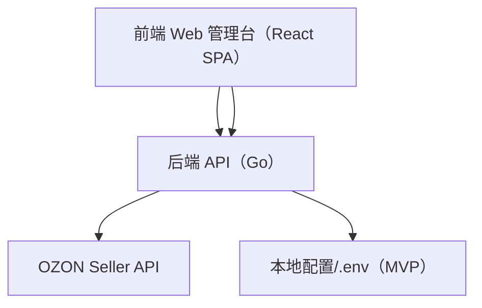
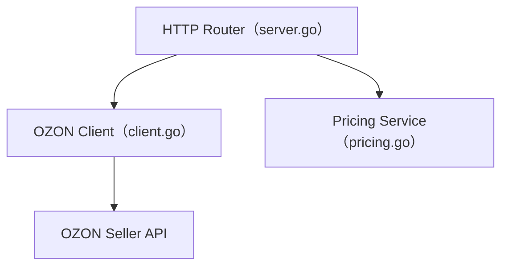

## 1. 架构设计


## 2. 技术说明
- 前端：React@18 + TypeScript + Vite + TailwindCSS
- 初始化工具：Vite
- 后端：现有 Go 服务（已实现本地代理接口与定价计算）
- 数据：MVP 暂不引入数据库（后续可接 MySQL/SQLite，用于任务/模板/成本方案/多店铺管理）
- 开发联调：前端通过 Vite proxy 转发到 `http://127.0.0.1:8080`

## 3. 路由定义
| Route | 用途 |
|---|---|
| / | 总览仪表盘 |
| /api | API 控制台 |
| /selection | 智能选品（信号） |
| /listing | 上品中心 |
| /pricing | 定价&利润 |
| /orders | 订单履约 |
| /returns | 售后退货 |
| /finance | 财务对账 |
| /settings | 设置 |

## 4. API 定义（基于已实现后端）
统一说明：前端只调用本地 Go 服务，不直接暴露 OZON 密钥到浏览器。

### 4.1 状态与店铺
- GET /ozon/status → { ok, expires_at, roles, method_count }
- GET /ozon/seller → seller/info 原始响应

### 4.2 类目与属性
- GET /ozon/categories/tree
- POST /ozon/categories/attribute
- POST /ozon/categories/attribute/values
- POST /ozon/categories/attribute/values/search
- POST /ozon/categories/tips

### 4.3 商品与上品
- POST /ozon/products/list
- POST /ozon/products/info/list
- POST /ozon/products/import
- POST /ozon/products/import/info
- POST /ozon/products/pictures/import
- POST /ozon/products/pictures/info
- POST /ozon/products/prices/import
- POST /ozon/products/stocks

### 4.4 选品信号
- POST /ozon/search-queries/top
- POST /ozon/search-queries/text
- POST /ozon/analytics/product-queries
- POST /ozon/analytics/product-queries/details
- POST /ozon/analytics/data
- POST /ozon/analytics/stocks

### 4.5 订单/售后/财务
- POST /ozon/posting/fbs/list
- POST /ozon/posting/fbs/unfulfilled/list
- POST /ozon/posting/fbs/ship
- POST /ozon/posting/fbs/tracking-number/set
- POST /ozon/posting/fbo/list
- POST /ozon/posting/fbp/list

- POST /ozon/returns/rfbs/list
- POST /ozon/returns/rfbs/get
- POST /ozon/returns/rfbs/reject
- POST /ozon/returns/rfbs/receive-return
- POST /ozon/returns/rfbs/return-money
- POST /ozon/returns/company/fbs/info

- POST /ozon/finance/transaction/list
- POST /ozon/finance/transaction/totals
- POST /ozon/finance/balance
- POST /ozon/finance/cash-flow-statement/list

### 4.6 定价&利润
- POST /pricing/calc

请求：
```ts
export type PricingCalcRequest = {
  cost_goods: number;
  cost_first_mile?: number;
  cost_last_mile?: number;
  cost_packaging?: number;
  cost_other?: number;
  target_profit?: number;
  platform_fee_rate?: number;
  payment_fee_rate?: number;
  tax_rate?: number;
  rounding?: number;
  min_price?: number;
  promotion_discount_pct?: number;
};
```

响应：
```ts
export type PricingCalcResponse = {
  total_cost: number;
  break_even_price: number;
  recommended_price: number;
  promotion_floor_price: number;
  assumed_total_fee_rate: number;
  target_profit: number;
  promotion_discount_pct: number;
};
```

## 5. 服务端架构（Go）


## 6. 数据模型（MVP）
MVP 不引入数据库，先用“API 调试优先”交付。
后续如需持久化，建议最小表：
- shops（多店铺）
- api_keys（密钥）
- cost_profiles（成本方案）
- product_drafts（上品草稿）
- import_tasks（导入任务）
- request_templates（API 请求模板）

